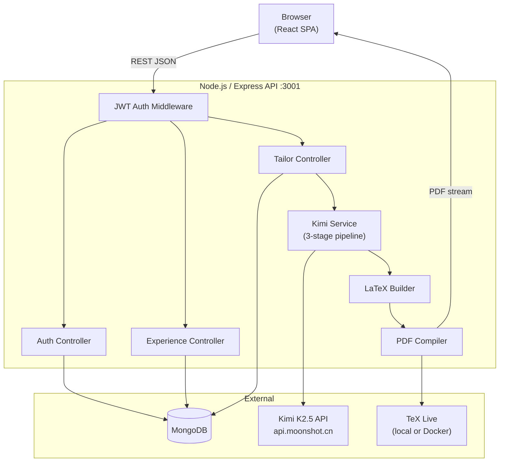

# Architecture

## System Overview



---

## Component Responsibilities

| Component | Location | Responsibility |
|---|---|---|
| React SPA | `client/src/` | UI, form state, API calls, PDF download trigger |
| Express API | `server/index.js` | Route registration, global error handler, CORS |
| JWT Middleware | `server/middleware/auth.js` | Verify Bearer token, attach `req.user` |
| Auth Controller | `server/controllers/auth.js` | Register, login, issue JWT |
| Experience Controller | `server/controllers/experience.js` | CRUD on MasterExperience documents |
| Tailor Controller | `server/controllers/tailor.js` | Orchestrate Kimi pipeline + PDF generation |
| Kimi Service | `server/services/kimiService.js` | 3-stage AI pipeline (extract → select → rewrite) |
| LaTeX Builder | `server/services/latexBuilder.js` | Assemble Jake's Resume `.tex` from rewritten data |
| PDF Service | `server/services/pdfService.js` | Compile `.tex` → `.pdf`, stream or store result |
| LaTeX Escape Util | `server/utils/latexEscape.js` | Sanitize user strings for LaTeX injection safety |

---

## Tailor Request — End-to-End Data Flow

This is the critical path that powers the core feature:

```
1. POST /api/tailor
   Body: { jobTitle, company, jobDescriptionRaw }
   Header: Authorization: Bearer <jwt>

2. TailorCtrl extracts userId from req.user

3. Fetch all MasterExperience docs for userId from MongoDB
   (only where visible: true, sorted by priority ASC)

4. KimiService.extractKeywords(jobDescriptionRaw)
   → { hardSkills[], softSkills[], roleKeywords[], seniorityLevel }

5. KimiService.selectExperiences(keywords, experiences)
   → selectedIds[]  (array of MasterExperience _id strings)

6. KimiService.rewriteBullets(selectedExperiences, keywords)
   → rewrittenMap: { [_id]: string[] }  (new bullet arrays)

7. LatexBuilder.build(selectedExperiences, rewrittenMap, { jobTitle, company })
   → latexString  (complete .tex document)

8. PDFService.compile(latexString)
   → pdfBuffer

9. TailoringSession saved to MongoDB:
   { userId, jobTitle, company, jobDescriptionRaw, extractedKeywords,
     selectedExperienceIds, generatedLatex, pdfStoragePath, createdAt }

10. Response:
    Content-Type: application/pdf
    Content-Disposition: attachment; filename="resume.pdf"
    Body: pdfBuffer stream

   — OR for preview mode —
    { latex: latexString, sessionId: <ObjectId> }
```

---

## Monorepo Layout

```
jobbutler/
├── client/                     # Vite + React 18
│   ├── public/
│   ├── src/
│   │   ├── api/
│   │   │   └── index.js        # Axios instance + all API call functions
│   │   ├── components/
│   │   │   ├── ExperienceCard.jsx
│   │   │   ├── ExperienceForm.jsx
│   │   │   ├── JobDescriptionInput.jsx
│   │   │   ├── ProgressStepper.jsx
│   │   │   └── ResumePreview.jsx
│   │   ├── context/
│   │   │   └── AuthContext.jsx  # React Context + useReducer for auth state
│   │   ├── pages/
│   │   │   ├── AuthPage.jsx
│   │   │   ├── MasterProfileDashboard.jsx
│   │   │   ├── TailorInterface.jsx
│   │   │   └── SessionHistory.jsx
│   │   ├── App.jsx              # Router setup
│   │   └── main.jsx
│   ├── index.html
│   └── package.json
│
├── server/
│   ├── controllers/
│   │   ├── auth.js
│   │   ├── experience.js
│   │   └── tailor.js
│   ├── middleware/
│   │   └── auth.js              # verifyToken middleware
│   ├── models/
│   │   ├── User.js
│   │   ├── MasterExperience.js
│   │   └── TailoringSession.js
│   ├── routes/
│   │   ├── auth.js
│   │   ├── experiences.js
│   │   └── tailor.js
│   ├── services/
│   │   ├── kimiService.js
│   │   ├── latexBuilder.js
│   │   └── pdfService.js
│   ├── utils/
│   │   └── latexEscape.js
│   ├── index.js                 # Express app entry point
│   └── package.json
│
├── docs/
└── .env.example
```

---

## Environment Variables

All variables live in `server/.env`. Copy from `.env.example`.

| Variable | Required | Description |
|---|---|---|
| `PORT` | No | Express port (default: `3001`) |
| `MONGODB_URI` | Yes | MongoDB connection string |
| `JWT_SECRET` | Yes | Secret for signing JWTs (min 32 chars) |
| `JWT_EXPIRES_IN` | No | Token TTL (default: `7d`) |
| `KIMI_API_KEY` | Yes | Moonshot AI API key |
| `KIMI_BASE_URL` | No | Base URL (default: `https://api.moonshot.cn/v1`) |
| `KIMI_MODEL` | No | Model ID (default: `moonshot-v1-128k`) |
| `PDF_BACKEND` | No | `node-latex` or `docker` (default: `node-latex`) |
| `DOCKER_LATEX_URL` | Cond. | HTTP URL of TeX Live sidecar when `PDF_BACKEND=docker` |
| `PDF_TMP_DIR` | No | Temp directory for `.tex` files (default: `/tmp/jobbutler`) |
| `PDF_STORAGE_PATH` | No | Persistent PDF storage dir (optional; leave blank to skip saving) |
| `CLIENT_ORIGIN` | No | CORS allowed origin (default: `http://localhost:5173`) |

---

## Cross-Cutting Concerns

### Authentication
- All `/api/experiences/*` and `/api/tailor/*` routes require `Authorization: Bearer <jwt>`.
- The `verifyToken` middleware validates the JWT and attaches `{ _id, email }` to `req.user`.
- Tokens expire per `JWT_EXPIRES_IN`; the client must handle `401` by redirecting to `/login`.

### Error Handling
- The Express global error handler (`server/index.js`) catches all errors thrown from controllers.
- Errors include a `status` (HTTP code) and `message` field.
- LaTeX compilation failures return `{ error: 'latex_compile_error', log: <trimmed-pdflatex-log> }` with status `422`.

### CORS
- Configured with the `cors` package; origin restricted to `CLIENT_ORIGIN` env variable.
- Credentials (`Authorization` header) are allowed.
